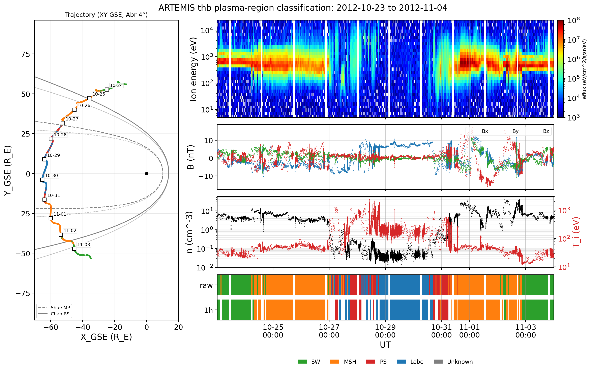

# artemis-cmmae

A pre-trained classifier for identifying plasma regions from ARTEMIS
spacecraft observations. Uses a Contrastive Multi-Modal Autoencoder
(C-MMAE) with supervised contrastive learning and Self-Organizing Map
(SOM) clustering. The default model achieves ~99% test accuracy across
four plasma regions (solar wind, magnetosheath, lobe, plasma sheet) on
held-out ARTEMIS observations.

[](docs/example_classification.png)

*A 12-day ARTEMIS (THEMIS-B) pass classified end-to-end: ion energy spectrogram,
GSE magnetic field, ion density + temperature, per-sample (`raw`) and 1-hour
persistence region strips, and the GSE X-Y trajectory with Shue magnetopause and
Chao bow-shock curves. Produced by
[`notebooks/classification_showcase.ipynb`](notebooks/classification_showcase.ipynb).* (You can click on the image to enlarge it).

## Classified Regions

| ID | Region |
|----|--------|
| -1 | Unknown |
| 0 | Solar Wind |
| 1 | Magnetosheath |
| 2 | Lobe |
| 3 | Plasma Sheet |

`-1` ("Unknown") is a genuine model output -- a sample that maps to an
unlabeled SOM node -- not an error.

## Installation

```bash
pip install git+https://github.com/jae1018/artemis-cmmae.git
```

Or clone and install locally:

```bash
git clone https://github.com/jae1018/artemis-cmmae.git
cd artemis-cmmae
pip install .
```

### Dependencies

Installed automatically with the package: numpy, pandas, torch, joblib,
scikit-learn, xpysom, pyspedas, cdflib, xarray, matplotlib.

## Quick Start

A single `PlasmaClassifier` exposes three ways to predict, from most convenient
to lowest-level. Construct it once (it loads the model), then call whichever
entry point matches your data:

```python
from artemis_cmmae import PlasmaClassifier

clf = PlasmaClassifier()   # loads the C-MMAE + SOM weights once

# 1) Easiest -- give a probe and a time range; it downloads, prepares, and
#    classifies in one call.
labels = clf.predict_from_pyspedas("thb", ["2020-09-01", "2020-09-02"])
print(labels[["region_name", "in_wake"]].head())
```

Already have data loaded, or your own prepared features?

```python
# 2) From loaded ESA + FGM datasets (xarray Datasets or dicts of arrays):
labels = clf.predict_from_ds(esa_ds, fgm_ds=fgm_ds)

# 3) From a fully-prepared feature table (see Input Data Format).  The bundled
#    sample is exactly such a frame:
from artemis_cmmae import load_sample_data
predictions, label_map = clf.predict(load_sample_data())
```

## API Reference

### `PlasmaClassifier(alpha=1)`

**Parameters:**
- `alpha` (int): Map size penalty controlling SOM granularity. One of `1`, `5`, or `10`.
  - `alpha=1`: 16x20 = 320 nodes (finest resolution, highest accuracy, default)
  - `alpha=5`: 9x11 = 99 nodes (medium)
  - `alpha=10`: 7x9 = 63 nodes (most compact)

The classifier provides three prediction entry points:

### `clf.predict_from_pyspedas(probe, trange, **kwargs)`

Download THEMIS/ARTEMIS ESA + FGM for a probe (`"thb"` or `"thc"`) over a
`[start, end]` time range via pyspedas, prepare the features, and classify --
all in one call. Returns a time-indexed
`DataFrame` (see [Prediction output](#prediction-output)). Useful options:
`no_update` (default `False`; set `True` for local-only, no download),
`drop_wake`, and `files` / `fgm_files` (read given local CDFs instead of
downloading). The download location is controlled by pyspedas's
`SPEDAS_DATA_DIR` environment variable (set it before first use).

### `clf.predict_from_ds(ds, fgm_ds=None, **kwargs)`

Classify already-loaded data. `ds` is a PEIF ESA dataset -- an xarray `Dataset`
or a dict of numpy arrays keyed by the native CDF variable names (e.g.
`thb_peif_en_eflux`, `thb_peif_en_eflux_yaxis`, `thb_peif_density`,
`thb_peif_sc_pot`, `thb_peif_time`) -- and `fgm_ds` supplies the GSE field
(`thb_fgs_gse`). Returns the same time-indexed `DataFrame`. This is the manual
form of `predict_from_pyspedas`.

### `clf.predict(df, batch_size=2048)`

Classify a fully-prepared feature table (see
[Input Data Format](#input-data-format)). Returns `(predictions, label_map)`
where `predictions` is an integer array of region ids and `label_map` maps ids
to names.

### Prediction output

`predict_from_pyspedas` and `predict_from_ds` return a `DataFrame` indexed by a
`DatetimeIndex` named `time`, with columns:

| Column | Meaning |
|--------|---------|
| `region_id` | Region id in `{-1, 0, 1, 2, 3}` (see [Classified Regions](#classified-regions)). |
| `region_name` | Human-readable region name. |
| `in_wake` | `True` if the sample is in the lunar wake (`SCPot <= 1 V` plus adjacent time steps). Wake samples are still classified; the flag lets you exclude them. |
| `X_GSE`, `Y_GSE`, `Z_GSE`, `X_GSM`, `Y_GSM`, `Z_GSM` | Spacecraft position in GSE and GSM (R_E). Always present from `predict_from_pyspedas` (it always loads the L1 state product); from `predict_from_ds` when a `state_ds` is supplied. |

Rows with non-finite scalars (`n`, `SCPot`, `BX_GSE` / `BY_GSE` / `BZ_GSE`) or
`n <= 0` cannot be classified and are dropped up front (with a one-line count
when `verbose=True`). Pass `return_features=True` to also return the feature
columns used -- `C0`..`C30`, `n`, `SCPot`, the GSE field
`BX_GSE` / `BY_GSE` / `BZ_GSE`, and the GSM field `BX_GSM` / `BY_GSM` / `BZ_GSM`.

**Only the GSE magnetic field ever enters the model** -- the C-MMAE was trained
on GSE B. The GSM field and all position columns are output-only context and
never reach the model.

### `build_features_from_ds(ds, fgm_ds=None, **kwargs)`

Top-level function that builds and returns the model-ready feature table
(`C0`..`C30`, `n`, `SCPot`, `BX_GSE` / `BY_GSE` / `BZ_GSE`, `in_wake`) from a dataset
**without** running the classifier -- handy for inspecting or QC-ing the
prepared features. `predict_from_ds` is this plus `predict`.

### Other methods

- `clf.predict_bmu(df, mode="1d")` -- Best Matching Unit indices on the SOM grid
  (`"1d"` flattened index, or `"2d"` `(i, j)` tuples).
- `clf.predict_with_embeddings(df)` -- dict with `predictions`, `bmu_1d`,
  `bmu_2d`, `embeddings_raw` (6-D latent), `embeddings_pca`, and `label_map`.

Lower-level building blocks live in the submodules: `artemis_cmmae.loaders`
(`load_esa`, `load_fgm`), `artemis_cmmae.features` (`prepare_ion_spectra`,
`flag_lunar_wake`, `REF_ENERGY_GRID_ASC`), and `artemis_cmmae.pipeline`.

## Input Data Format

If you use `predict_from_pyspedas` or `predict_from_ds`, the package builds these
features for you from the raw ESA/FGM data -- you can skip this section. It
matters only for the low-level `clf.predict(df)` path, where you supply the
prepared table directly.

Your DataFrame must contain the following columns, all in physical
(linear-scale) units:

| Column(s) | Description | Units |
|-----------|-------------|-------|
| `C0` - `C30` | Ion energy flux, 31 channels in **ascending** energy order (C0 = lowest), interpolated onto the model's fixed log-spaced grid (~5 eV to ~25 keV) | eV/(cm^2 s sr eV) |
| `n` | Ion number density (must be > 0) | cm^-3 |
| `SCPot` | Spacecraft potential | V |
| `BX_GSE`, `BY_GSE`, `BZ_GSE` | Magnetic field components in GSE | nT |

**Energy order and interpolation matter.** The model was trained on spectra
re-gridded onto a fixed 31-bin grid in **ascending** energy order. Raw THEMIS
PEIF spectra arrive in **descending** order and differ by instrument sweep mode,
so they must be interpolated onto that grid first. The high-level entry points
(and `build_features_from_ds`) do this correctly; if you build the table
yourself, replicate it with `artemis_cmmae.features.prepare_ion_spectra` and
`REF_ENERGY_GRID_ASC`.

The classifier internally applies `log10(eflux + 1)` to the energy channels and
`log10(n)` to density, then standardizes with fixed training-set statistics --
pass LINEAR units, no pre-transforms. The index should be a `DatetimeIndex`
named `time`.

## Sample Data

A one-month sample dataset (September 2020) is bundled with the package. Load it
with `load_sample_data()` or find it at `artemis_cmmae/sample_data/sample.csv`.
See [`quickstart.py`](quickstart.py) for usage.

## Paper and Data

This package accompanies the following publication, submitted to
Journal of Geophysical Research: Machine Learning and Computation:

> Edmond, J., Ferdousi, B., Johnston, W. R., & Lewis, N. (2026).
> *Semi-Supervised Plasma Region Classification in Earth's Cislunar
> Magnetotail using ARTEMIS Observations*.

The full training data, HPO results, and reproducibility archive are
available on Zenodo: [10.5281/zenodo.19447300](https://zenodo.org/records/19447300)

## Distribution Statement

Approved for public release; distribution is unlimited. Public Affairs release
approval #AFRL20261291.

## License

MIT
